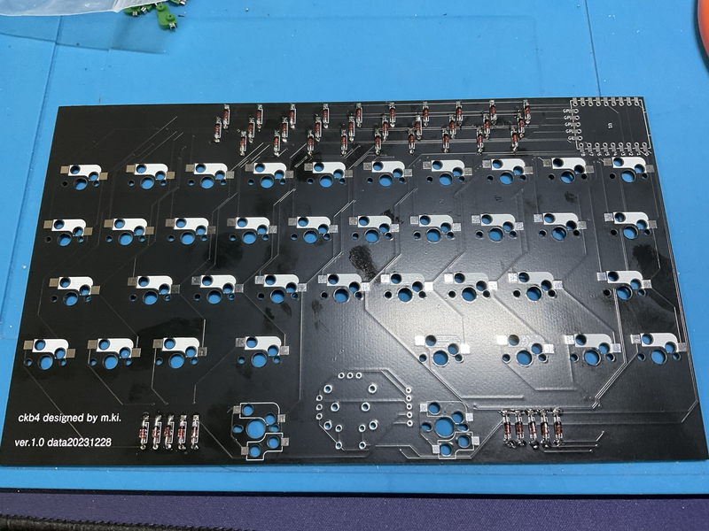
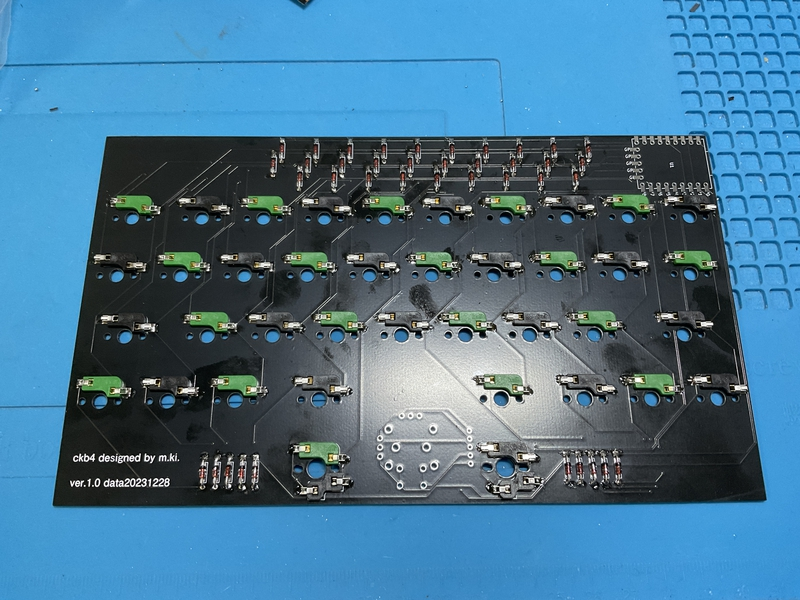

## Build guide

## Firmware

###  QMK_FIRMWARE

参考 

https://github.com/telzo2000/Hello_keyboard/blob/main/readme_about_firmware.md

[Here](https://github.com/telzo2000/ckb4/tree/main/firmware)

 

[vial](https://get.vial.today/) is possible.

 

## Build 1

### 1 Diode soldering

Solder the diodes to the back of PCB.
 
PCBの裏面にダイオードのハンダ付けをします。
 
There are lead type and SMD diodes.
 
ダイオードはリードタイプか、SMDがあります。
 
Here, we will explain the lead type soldering.
 
ここでは、リードタイプのハンダ付けの説明をします。
 

Use a lead bender to bend the legs of the diode.
 
リードベンダーを使い、ダイオードの足を曲げます。
 
Insert the diode into the board.
 
ダイオードを基板に挿しこみます。
 

Please pay attention to the orientation of the diode.
 
ダイオードの向きに注意してください。
 

Secure the diode with masking tape, then face up.
 
マスキングテープでダイオードを固定してから、表面を上にします。
 
Solder the protruding legs.
 
はみ出ている足部分に、ハンダ付けをします。
 
After soldering, use nippers to cut off the protruding legs.
 
はんだ付けが終わったら、はみ出ている足をニッパーで切り取ってください。
 

[８倍速　Diodeハンダ付け動画](https://youtu.be/Yaodh2-XxV4)

 
 

### 2 Soldering switch sockets

Solder the switch sockets on the back side.
 
裏面にスイッチソケットのハンダ付けをします。
 

Note

 
The bottom row has cherry MX and Kailh choc switch sockets, but this is a prototype. Currently, it supports choc.
 
最下段に、cherry MXとKailh chocのスイッチソケットが付いているが、これは試作品です。現在は、choc対応になっている。

[８倍速　Switch socketハンダ付け動画](https://youtu.be/E__mHvmIXQo)

  

### 3　Soldering RP-2040Zero  

The side on which components such as the boot button and reset button of RP-2040Zero are mounted is the front side, and the other side is the back side.
 
RP-2040Zeroのbootボタンやresetボタンなど部品実装されている面を表面とし、反対側を裏面とします。
 
Place the back side of the PCB and the back side of the RP-2040Zero facing each other and solder the respective terminals.
 
PCBの裏面とRP-2040Zeroの裏面が向かい合うようにして置き、それぞれの端子をハンダ付けします。
 
 

### 4 Soldering Joystick and Rotaly encodaer

Insert the joystick or rotary encoder from the front side of the PCB and solder it on the back side of the PCB.
 
PCB表面から、ジョイスティックやロータリーエンコーダーを差し込み、PCB裏面ではんだ付けをします。

  

### 5 Instorlling QMK＿Firmware

Install QMK_Firmware from your PC to RP-2040Zero.
 
QMK_FirmwareをPCからRP-2040Zeroにインストールしてください。
 
 
① Download https://github.com/telzo2000/ckb4/blob/main/firmware/ckb4_vial.uf2 to your PC.
 
① https://github.com/telzo2000/ckb4/blob/main/firmware/ckb4_vial.uf2　をPCにダウンロードしておく。

  
② Connect the PC and RP-2040Zero with a USB cable.
 
②PCとRP-2040ZeroをUSBケーブルで繋ぐ。
  
③Press the reset button while pressing the boost button on the RP-2040Zero.
 
③RP-2040Zeroのboostボタン押しながら、resetボタンを押す。
  
④Since there is a folder of RP-2040Zero on the PC screen, drag and drop the downloaded ckb4_vial.uf2 there.
 
④PC画面にはRP-2040Zeroのフォルダがあるので、そこに、ダウンロードしたckb4_vial.uf2をドラッグアンドドロップする。
  

⑤Check if it is recognized by connecting to [vial](https://get.vial.today/). Edit the keymap accordingly.
 
⑤[vial](https://get.vial.today/)に繋いで認識するかどうか確認する。合わせてキーマップの編集をする。

### Build 2(case)

### 1 Case

Insert the switch into the top case from above and secure it with the PCB switch socket from the bottom of the top case.
 
トップケースに上からスイッチを差し込み、トップケースの下側からPCBのスイッチソケットで固定する。
  

After inserting all the key switches, attach the rotary encoder knob and joystick cap.
 
すべてのキースイッチを差し込んだ後、ロータリーエンコーダーのノブやジョイスティックのキャップを装着する。
  

Fix the bottom case by fitting the uneven part on the front side.
 

ボトムケースは、手前の凹凸部をはめ込むようにして、固定する。
  
If necessary, attach magnets to the round indentations on the sides of the top and bottom cases.
 
必要であれば、トップケースとボトムケースの側面の丸い窪みに磁石をつけると、よい。
  

Welcome to the world of the best keyboards.
 
最高のキーボードの世界にようこそ。
 

